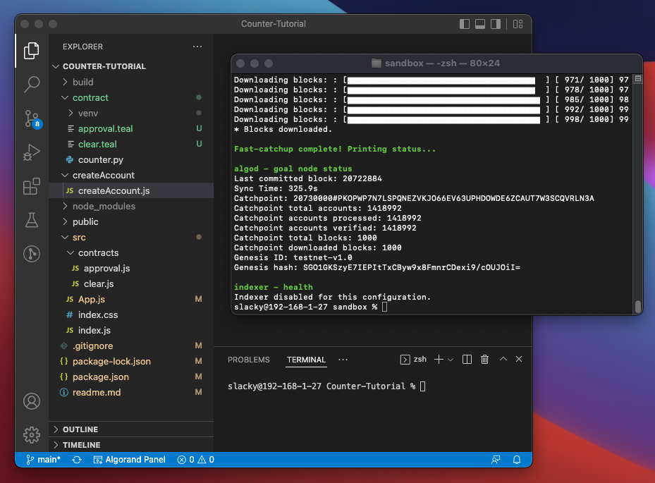
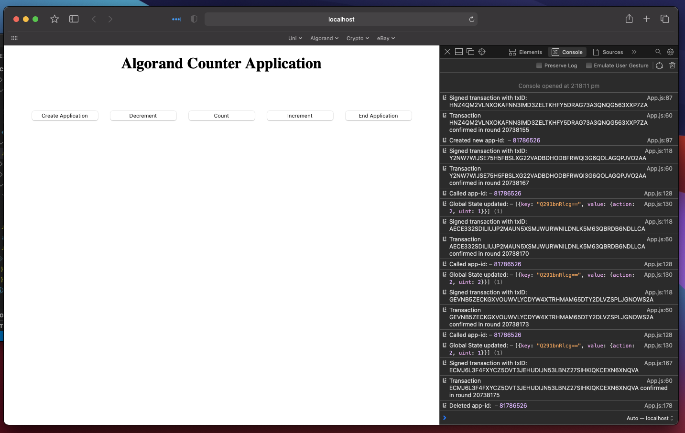

# Build a counter application with React and Algorand using PyTeal and the JavaScript SDK

Setting up counter app from tutorial (https://github.com/AnthonyP128/Counter-Tutorial) using my own accounts and dev setup

Sanbox Running

My accounts 
1. 3RWV5YH5H6QMRI24MIGOA6RG2TID6FGXDDNLQ2KWB6QNSGE5MTBYNOXZQY
2. 2L7PGWB72EMDJNWJWR6SNEVHPBG5BTGW2FHEC4VBT52AG64VYKJE2YKEX4

Application Running

https://testnet.algoexplorer.io/application/81786526

